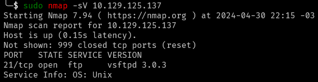
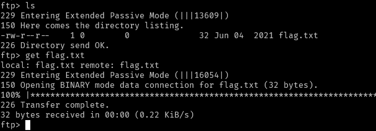
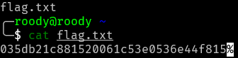

## Meow Write-up

- Machine Level: Very Easy
- Machine Type: Linux

### Tasks

- Task 1: What does the 3-letter acronym FTP stand for?

  - **Answer: File Transfer Protocol**

- Task 2: Which port does the FTP service listen on usually?

  - **Answer: 21**

- Task 3: What acronym is used for the secure version of FTP?

  - **Answer: SFTP**

- Task 4: What is the command we can use to send an ICMP echo request to test our connection to the target?

  - **Answer: ping**

- Task 5: From your scans, what version is FTP running on the target?

  

  - **Answer: vsFTPd 3.0.3**

- Task 6: From your scans, what OS type is running on the target?

  - **Answer: Unix (using the same print from task 5)**

- Task 7: What is the command we need to run in order to display the 'ftp' client help menu?

  - **Answer: ftp -h**

- Task 8: What is username that is used over FTP when you want to log in without having an account?

  - **Answer: anonymous**

- Task 9: What is the response code we get for the FTP message 'Login successful'?

  - **Answer: 230**

- Task 10: There are a couple of commands we can use to list the files and directories available on the FTP server. One is dir. What is the other that is a common way to list files on a Linux system.

  - **Answer: ls**

- Task 11: What is the command used to download the file we found on the FTP server?

  - **Answer: get**

- Root flag:

