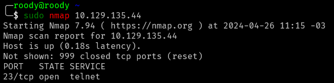
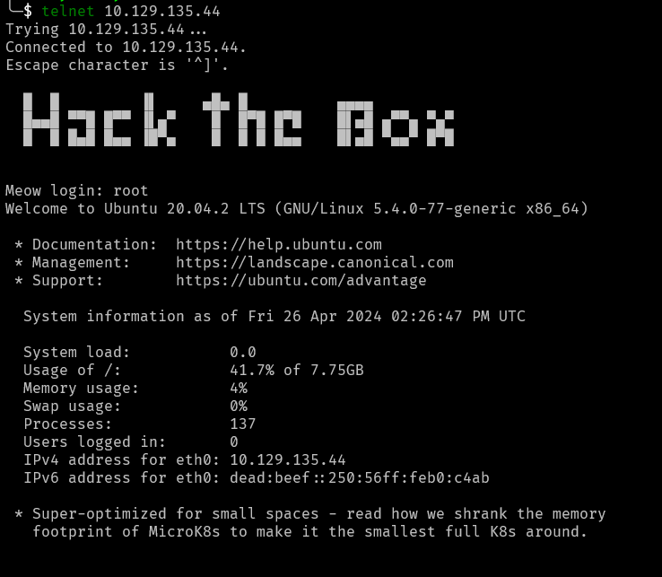
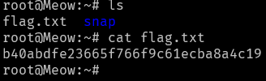

## Meow Write-up

- Machine Level: Very Easy
- Machine Type: Linux

### Tasks

- Task 1: What does the acronym VM stand for?
    - **Answer: Virtual Machine**

- Task 2:  What tool do we use to interact with the operating system in order to issue commands via the command line, such as the one to start our VPN connection? It's also known as a console or shell.
    - **Answer: Terminal**

- Task 3: What service do we use to form our VPN connection into HTB labs?
    - **Answer: openvpn**

- Task 4 What tool do we use to test our connection to the target with an ICMP echo request?
    - **Answer: ping**

- Task 5: What is the name of the most common tool for finding open ports on a target? 
    - **Answer: nmap**

- Task 6: What service do we identify on port 23/tcp during our scans?
    - Description: I started scanning the target using the tool answered in the task 5

    

    - **Answer: the service running is telnet**

- Task 7: What username is able to log into the target over telnet with a blank password?
    - Description: Let's try to open a connection using telnet, generally, telnet use default users to log in with blank password, such as "admin", "root", etc. I'm my first attempt I've decided to use root.

    

    - Explanation: Telnet is a protocol that allows you to remotly control another machine, so here I used telnet to create a connection with the target and now, we can explore inside this server, which as seen in the first lines `Ubuntu 20.04.2 LTS`. Just making a simple `ls` command and `cat`, I got the flag and submited in the next answer.

    